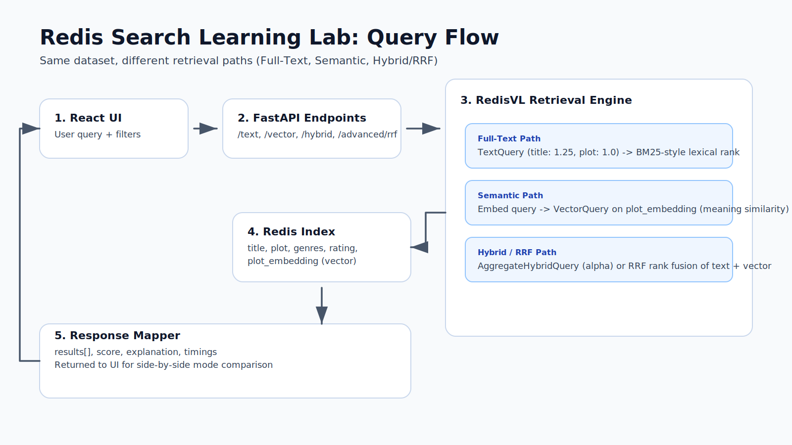
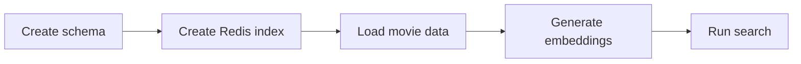

# Redis Search Learning Lab

Guided learning app for exploring full-text, vector, and hybrid search with Redis.

## Architecture



See the full architecture write-up: [Architecture Diagram](docs/architecture-diagram.md).

## How It Works

This lab follows the same RedisVL lifecycle for every search mode:



### Simple Steps Using RedisVL

1. Create an `IndexSchema` that describes the movie fields Redis will index.
2. Create a `SearchIndex` from that schema in Redis.
3. Fetch and normalize `movies.json` into clean records.
4. Generate `plot_embedding` vectors for each movie plot.
5. Load the records into Redis JSON with `index.load(...)`.
6. Run one of the search modes:
   `TextQuery` for lexical search, `VectorQuery` for semantic search, or `AggregateHybridQuery` / RRF for combined ranking.

## Stack

- Frontend: React + TypeScript + Vite
- Backend: FastAPI + RedisVL
- Python environment: `uv`
- Dataset: [`movies.json` (workshop-complete)](https://github.com/redis-developer/building-hybrid-search-apps-with-redis/blob/workshop-complete/data/movies.json)

## Backend

```bash
cd backend
UV_CACHE_DIR=.uv-cache uv sync
UV_CACHE_DIR=.uv-cache uv run pytest -q
UV_CACHE_DIR=.uv-cache uv run uvicorn app.main:app --reload --port 18000
```

## Frontend

```bash
cd frontend
npm install
npm run test
npm run dev
```

By default, the frontend points to `http://127.0.0.1:18000`. Set `VITE_API_BASE_URL` if your backend runs on a different host/port.

## API Endpoints

- `POST /api/search/text`
- `POST /api/search/vector`
- `POST /api/search/hybrid`
- `POST /api/search/advanced/rrf`
- `POST /api/search/advanced/rerank`
- `GET /api/overview`
- `POST /api/similarity`
- `GET /api/health`

## Learning Guides

- [Full-Text Search Basics](docs/full-text-search-basics.md)
- [Semantic Search Basics](docs/semantic-search-basics.md)
- [Hybrid Search Basics](docs/hybrid-search-basics.md)
- [Architecture Diagram](docs/architecture-diagram.md)

## Other Workshops

- Workshop for Java developers: [building-hybrid-search-apps-with-redis](https://github.com/redis-developer/building-hybrid-search-apps-with-redis/)
- Workshop for Python developers: [full-stack-redis-ai-workshop](https://github.com/redis-developer/full-stack-redis-ai-workshop)

## Logs Guide

Set backend log level with `LAB_LOG_LEVEL` (default: `INFO`):

```bash
LAB_LOG_LEVEL=INFO UV_CACHE_DIR=.uv-cache uv run uvicorn app.main:app --reload --port 18000
```

### What You’ll See

- Startup/bootstrap lifecycle: `api.lifespan.start`, `service.bootstrap.start`, `dataset.fetch.start`, `dataset.normalize.done`, `service.bootstrap.done`, `api.lifespan.ready`
- Per-request API logging: `api.search.text`, `api.search.vector`, `api.search.hybrid`, `api.search.rrf`, `api.search.rerank`, `api.overview`, `api.similarity`
- Service-level query internals: `service.query.text.done`, `service.query.vector.done`, `service.search.<mode>.done`

### Demo Narrative Tip

During your demo, keep the backend logs visible in a terminal while driving the UI:
1. Show bootstrap logs after server start.
2. Run each tab (`Full-Text`, `Semantic`, `Hybrid`, `Compare`) and point to corresponding `api.search.*` lines.
3. Use `Similarity Lab` and highlight the `api.similarity.done cosine=...` output.
