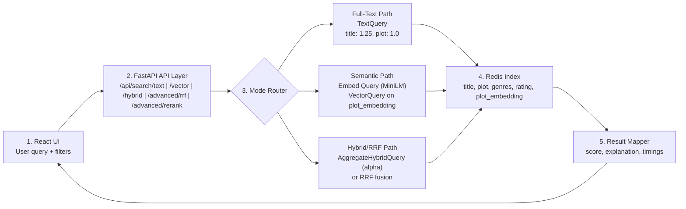

# Search Architecture Diagram

This page gives you a presentation-ready architecture visual for the Redis Search Learning Lab.

## Diagram (Image)

The SVG above is the presentation-accurate version. Use the Mermaid block below as the conceptual/editable fallback.

## Mermaid Version (Editable)

## Code Touchpoints

- Full-text mode: [backend/app/search/modes/full_text.py](../backend/app/search/modes/full_text.py)
- Semantic mode: [backend/app/search/modes/semantic.py](../backend/app/search/modes/semantic.py)
- Hybrid mode: [backend/app/search/modes/hybrid.py](../backend/app/search/modes/hybrid.py)
- RRF/service orchestration: [backend/app/search/redis_service.py](../backend/app/search/redis_service.py)
- API routes: [backend/app/main.py](../backend/app/main.py)
- Frontend request wiring: [frontend/src/api.ts](../frontend/src/api.ts)
