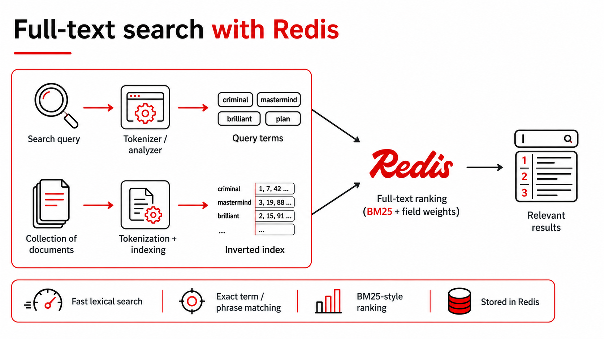
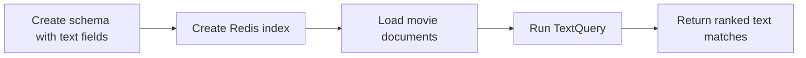

# Full-Text Search Basics



This diagram shows the lexical search path in this project: queries and documents are tokenized into terms, Redis matches against the inverted index, and results are ranked with BM25-style scoring plus field weights.

## Simple Steps Using RedisVL



1. Create a schema that includes searchable text fields like `title` and `plot`.
2. Create the Redis index from that schema with RedisVL.
3. Load the normalized movie documents into Redis.
4. Send the user query through `TextQuery`.
5. Redis ranks documents by lexical matches and returns the top results.

## What It Is
Full-text search is lexical retrieval: it ranks documents based on how query terms appear in indexed text fields. In this project, it is strongest when users type specific keywords that should appear in movie `title` or `plot`.

## How This Codebase Implements It
The backend builds a `TextQuery` and executes it against Redis with weighted text fields (`title` weighted above `plot`):

```python
q = TextQuery(
    text=query,
    text_field_name={"title": 1.25, "plot": 1.0},
    num_results=limit,
    filter_expression=self._build_filter(genres, min_rating),
    return_fields=RETURN_FIELDS,
    return_score=True
)
```

The route is exposed at `POST /api/search/text`, and the frontend calls it through `searchText(...)`.

## Strengths
- High precision for exact terms and phrases.
- Fast ranking with clear lexical relevance behavior.
- Great for queries where users know the exact words.

## Weaknesses / Limitations
- Brittle with synonyms and paraphrases (`"heist mastermind"` vs `"criminal planner"`).
- Misses intent when the wording differs from indexed text.
- Can over-favor keyword frequency over semantic meaning.

## Why the Next Mode Exists
Semantic search exists because users do not always type the exact words present in documents. We need vector-based intent matching for paraphrases and concept-level similarity.

## When To Use It (Practical Examples)
- Exact-title or near-exact-title lookup.
- Legal/policy/product keyword search where exact wording matters.
- Log/event filtering by concrete tokens or IDs.

## Request/Response Example
Request:

```json
{
  "query": "criminal mastermind",
  "limit": 5,
  "filters": {
    "genres": ["Drama"],
    "min_rating": 6.0
  }
}
```

Response fields to read:
- `results[].score`: lexical relevance score from full-text ranking.
- `timings.search_ms`: query latency for the text retrieval call.
- `lesson_takeaway`: short mode summary for demos.

## Read the Code
- Backend text query builder and row retrieval:
  - [`build_text_query`](../backend/app/search/modes/full_text.py#L19)
  - [`query_text_rows`](../backend/app/search/modes/full_text.py#L38)
- Service orchestration for text search:
  - [`RedisVLSearchService.search_text`](../backend/app/search/redis_service.py#L83)
- API endpoint:
  - [`POST /api/search/text`](../backend/app/main.py#L67)
- Frontend caller:
  - [`searchText`](../frontend/src/api.ts#L25)
- Related typed row normalization:
  - [`RetrievedRow` schema](../backend/app/schemas.py#L76)

## Cross-Mode Comparison
For a consolidated comparison table across Full-Text, Semantic, and Hybrid, see:
- [Hybrid guide comparison table](./hybrid-search-basics.md#comparison-table-full-text-vs-semantic-vs-hybrid)
