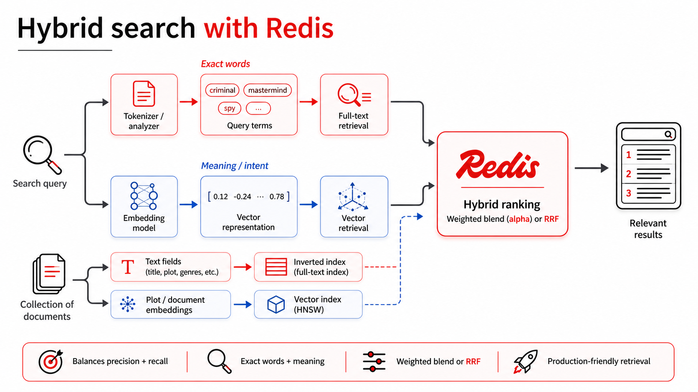
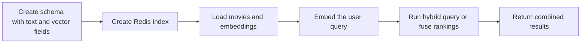

# Hybrid Search Basics

## What It Is
Hybrid search combines lexical and semantic retrieval signals to improve robustness across diverse query styles. In this app, you can use weighted hybrid scoring and advanced rank fusion (RRF).

## Concept Diagram



This diagram shows the combined retrieval path in this project: the same query fans out into both lexical and semantic search, Redis merges those signals with weighted blending or rank fusion, and the app returns one ranked result set.

## When To Use It (Practical Examples)
- Production search with broad user behavior variance.
- E-commerce/catalog experiences balancing exact attributes and intent phrasing.
- Media discovery where titles/keywords and plot semantics both matter.

## Example Queries
### Works well for
- `"spy thriller with emotional depth"`
- `"magic school adventure with danger"`
- `"heist with brilliant planner"`
- `"hero saves world from alien invasion"`

### Weaker fit for
- `"The Matrix"` when a simple exact-title lookup would likely be handled just as well by full-text alone.

## Strengths
- Best-of-both behavior for mixed user query styles.
- Better resilience when some users are keyword-heavy and others are intent-heavy.
- Supports tunable strategies (`alpha`, `rrf_k`, `rrf_weights`).

## Weaknesses / Limitations
- More tuning complexity than single-mode retrieval.
- Harder interpretability and troubleshooting when multiple signals interact.
- Potentially higher latency from embedding + multi-stage retrieval.

## Simple Steps Using RedisVL



1. Create a schema that supports both text fields and the `plot_embedding` vector field.
2. Create the Redis index from that schema with RedisVL.
3. Generate embeddings for movie plots and load all records into Redis.
4. Embed the user query.
5. Run `AggregateHybridQuery` or combine text and vector rankings with RRF.
6. Return results that balance exact keyword matches and semantic meaning.

## How This Codebase Implements It
The weighted hybrid path uses `AggregateHybridQuery` with `alpha` to balance text vs vector influence:

```python
q = AggregateHybridQuery(
    text=query,
    text_field_name="plot",
    vector=vector,
    vector_field_name="plot_embedding",
    filter_expression=self._build_filter(genres, min_rating),
    alpha=alpha,
    num_results=limit,
    return_fields=RETURN_FIELDS,
    stopwords=None,
)
```

The advanced path fuses independent text and vector rankings with Reciprocal Rank Fusion (RRF).

## Request/Response Example
Weighted hybrid request:

```json
{
  "query": "spy thriller with emotional depth",
  "limit": 5,
  "filters": {
    "genres": ["Thriller"],
    "min_rating": 6.5
  },
  "hybrid": {
    "alpha": 0.7
  }
}
```

RRF request:

```json
{
  "query": "spy thriller with emotional depth",
  "limit": 5,
  "filters": {
    "genres": ["Thriller"],
    "min_rating": 6.5
  },
  "advanced": {
    "rrf_k": 60,
    "rrf_weights": [0.5, 0.5]
  }
}
```

Response fields to read:
- `results[].score`: combined score (weighted hybrid or fused RRF score).
- `timings.embed_ms`, `timings.search_ms`, and mode-specific timing keys.
- `mode`: distinguishes `hybrid` vs `rrf`.

## Read the Code
- Weighted hybrid implementation:
  - [`build_hybrid_query`](../backend/app/search/modes/hybrid.py#L21)
  - [`query_hybrid_rows`](../backend/app/search/modes/hybrid.py#L43)
  - [`RedisVLSearchService.search_hybrid`](../backend/app/search/redis_service.py#L115)
- RRF implementation:
  - [`fuse_rankings_rrf`](../backend/app/search/modes/advanced.py#L19)
  - [`collect_rrf_candidates`](../backend/app/search/modes/advanced.py#L43)
  - [`RedisVLSearchService.search_rrf`](../backend/app/search/redis_service.py#L146)
- API endpoints:
  - [`POST /api/search/hybrid`](../backend/app/main.py#L91)
  - [`POST /api/search/advanced/rrf`](../backend/app/main.py#L111)
- Frontend callers:
  - [`searchHybrid`](../frontend/src/api.ts#L33)
  - [`searchAdvancedRrf`](../frontend/src/api.ts#L37)
- Typed internal row normalization:
  - [`RetrievedRow` schema](../backend/app/schemas.py#L76)

## Why the Next Mode Exists
Once hybrid is in place, advanced ranking strategies (RRF and reranking) help stabilize or improve ordering quality when weighted blending alone is not enough.

## Comparison Table: Full-Text vs Semantic vs Hybrid
| Mode | Best For | Strengths | Weaknesses / Limitations | Typical Query Style | Explainability | Latency Profile | Tuning Required |
|---|---|---|---|---|---|---|---|
| Full-Text | Exact term/phrase retrieval | High lexical precision, simple behavior, fast search path | Weak with paraphrases/synonyms; intent mismatch risk | `"criminal mastermind"` | High (visible term overlap) | Usually lowest (`search_ms`) | Low |
| Semantic | Intent/paraphrase retrieval | Strong meaning-level recall, natural-language friendly | Can drift on strict exact-token intent; embedding dependency | `"movie about redemption after war"` | Medium (vector similarity less intuitive) | Higher (embedding + vector search: `embed_ms`, `search_ms`) | Medium |
| Hybrid | Mixed precision + intent needs | Balances exact words and meaning, more robust overall | More moving parts (`alpha`/fusion), harder debugging | `"spy thriller with emotional depth"` | Medium (multi-signal) | Moderate to higher (embedding + blended/fused retrieval timings) | Medium to high |
