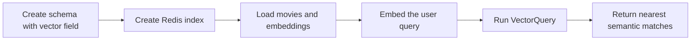

# Semantic Search Basics

## Simple Steps Using RedisVL



1. Create a schema that includes the `plot_embedding` vector field.
2. Create the Redis index from that schema with RedisVL.
3. Generate embeddings for each movie plot and load the records into Redis.
4. Convert the user query into an embedding vector.
5. Run `VectorQuery` to find the nearest matching plots by meaning.

## What It Is
Semantic search retrieves by meaning, not just matching words. It converts text into vectors and finds documents with nearby embeddings in vector space.

## How This Codebase Implements It
This project embeds the query with `HFTextVectorizer` and runs a `VectorQuery` on `plot_embedding`:

```python
vector = vectorizer.embed(query)
q = VectorQuery(
    vector=vector,
    vector_field_name="plot_embedding",
    num_results=limit,
    filter_expression=self._build_filter(genres, min_rating),
    return_fields=RETURN_FIELDS,
    return_score=True,
)
```

Rows are validated through a typed Pydantic model (`RetrievedRow`) before they are transformed to API results.

## Strengths
- Handles paraphrases and intent-level queries well.
- Improves discovery when users describe concepts, not exact terms.
- Works well for natural-language search UX.

## Weaknesses / Limitations
- Less reliable for strict exact-token constraints.
- Can return conceptually related but lexically unexpected results.
- Requires embedding compute (`embed_ms`) and model/runtime dependencies.

## Why the Next Mode Exists
Hybrid search exists to combine lexical precision with semantic recall, so exact matches and intent matches both contribute to ranking.

## When To Use It (Practical Examples)
- Natural-language discovery (`"movie about redemption after war"`).
- Support/help search with many paraphrased user questions.
- Content exploration where user vocabulary varies widely.

## Request/Response Example
Request:

```json
{
  "query": "a teacher inspires troubled students",
  "limit": 5,
  "filters": {
    "genres": [],
    "min_rating": 7.0
  }
}
```

Response fields to read:
- `results[].score`: vector distance/similarity-derived ranking signal.
- `timings.embed_ms`: query embedding latency.
- `timings.search_ms`: vector index retrieval latency.

## Read the Code
- Backend vectorization and vector query:
  - [`embed_query`](../backend/app/search/modes/semantic.py#L22)
  - [`build_vector_query`](../backend/app/search/modes/semantic.py#L29)
  - [`query_vector_rows`](../backend/app/search/modes/semantic.py#L45)
- Service orchestration for semantic search:
  - [`RedisVLSearchService._get_vectorizer`](../backend/app/search/redis_service.py#L43)
  - [`RedisVLSearchService.search_vector`](../backend/app/search/redis_service.py#L90)
- API endpoint:
  - [`POST /api/search/vector`](../backend/app/main.py#L78)
- Frontend caller:
  - [`searchVector`](../frontend/src/api.ts#L29)
- Typed internal row model:
  - [`RetrievedRow`](../backend/app/schemas.py#L76)

## Cross-Mode Comparison
For a consolidated comparison table across Full-Text, Semantic, and Hybrid, see:
- [Hybrid guide comparison table](./hybrid-search-basics.md#comparison-table-full-text-vs-semantic-vs-hybrid)
